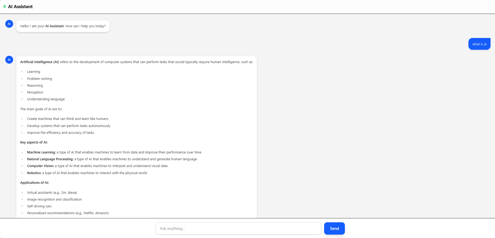
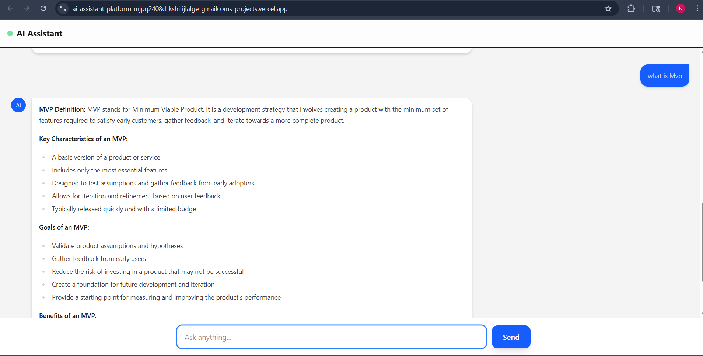

# AI Assistant Platform

This is an AI Assistant Platform that allows users to interact with a conversational AI. Users can ask questions or seek assistance, and the AI responds in real-time. The platform is deployed and accessible via the web.

## Deployment Link

live link : https://ai-assistant-platform-ochre.vercel.app/

⚠️ Note on API Usage and Live Demo

        This AI Assistant Platform is powered by the Grok API. Please note:

        The API key used for this project has a limited usage period of 7 days.

        API Key Validity Window: 31 March 2026 → 6 April 2026

        After 6 April 2026, the API key will expire, and the live demo may stop responding or fail to generate AI outputs.

        To restore functionality, a new API key must be generated and updated in the backend.

This is expected behavior due to the limitations of the free/testing Grok API. Anyone reviewing or testing the project should be aware that AI responses may not work beyond the 7-day window unless the API key is refreshed.

## Technologies Used

Frontend: React, TailwindCSS
Backend: Node.js, Express
AI: Grok API
Deployment: Render (backend) & Vercel (frontend)

### Results

#### Screenshot 1

#### Screenshot 2

#### Demo Video
